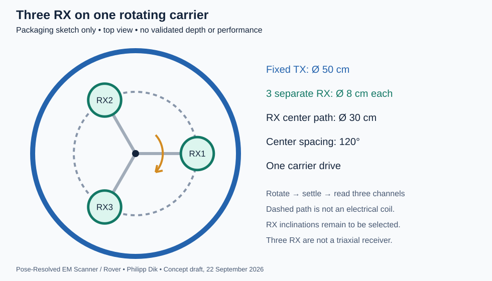

# Pose-Resolved EM Scanner / Rover

**Author: Philipp Dik**  
**Status: research concept; a working geometry is proposed, not validated hardware.**  
**Evidence-grounded concept update: 24 September 2026. No demonstrated overall novelty or performance advantage.**

Pose-Resolved EM Scanner / Rover proposes an electromagnetic induction (EMI) scanning workflow in which measurements are interpreted using the actual positions and orientations of the transmitting (TX) and receiving (RX) coils. Measurements from different configurations are combined to estimate target location and electromagnetic response, with uncertainty. A subsequent measurement may be selected from the current estimate to improve information about an unresolved region or target.

The core is joint interpretation of registered measurements and a calibrated reference library, not rotation alone. The present working embodiment is a mobile or stationary platform with a large TX loop and three separately read RX coils on one rotating carrier. The carrier moves independently of the TX. This is a candidate implementation, not an established optimum. The physical sensing mechanisms and several constituent methods have substantial [prior art](PRIOR_ART.md).

## What the existing experiments support

Published measurements provide a practical basis for developing this concept. ALLTEM combined multiaxis EMI, calibration-trained interpretation and physical inversion, with separate blind field evaluations. Song et al. demonstrated sequential placement and joint interpretation of new MPV measurements in controlled indoor experiments. Feldkamp and Quirk demonstrated synchronized optical coil tracking and three-dimensional reconstruction of laboratory conductivity phantoms. These are physical demonstrations of relevant parts of the workflow, not measurements made with this project's head.

The [experimental basis](docs/EXPERIMENTAL_BASIS.md) identifies the actual experiment, what can be reused and the boundary of each inference. It also retains negative findings, including tracking problems and reconstruction ambiguity. Published results justify an evidence-grounded engineering specification; they do not transfer detection depth, accuracy, speed or a complete-system validation to the proposed three-RX geometry.

This repository is a concept and design record. It does not contain a completed instrument, a trained reconstruction implementation or the cited authors' raw experimental datasets. A new project-specific experiment is needed for performance claims, but is not a prerequisite for documenting the design now.

| Read next | Purpose |
|---|---|
| [Experimental basis](docs/EXPERIMENTAL_BASIS.md) | Physical measurements supporting the design and limits of transfer |
| [Design specification](docs/DESIGN_SPEC.md) | System interfaces, fixed-model map updates and unresolved implementation parameters |
| [Reconstruction](docs/RECONSTRUCTION.md) | Proposed inference and the meaning of the spatial output |
| [Validation status](docs/VALIDATION.md) | Structural results, local numerical checks and remaining claims |
| [Future comparison](docs/BENCHMARK.md) | A bounded test if apparatus or suitable recorded measurements become available |
| [Prior art](PRIOR_ART.md) | Scientific and patent overlaps, including established adaptive methods |

## Research hypothesis: improving the map as measurements accumulate

The research hypothesis is that joint processing of registered EMI measurements, supported by learning from known reference scenes, can improve a subsurface target-location map within a declared class of targets and conditions. The intended cycle is: first measurements, initial map, additional angles or spatial positions, then an updated map using all unique measurements. The possible benefit of ML is tested against physical reconstruction that receives the same accumulated data and also updates its map.

Any learned model and reference library are prepared before scanning and kept fixed during the survey. New passes update the estimated scene and its uncertainty; online retraining is outside this formulation. Useful additional data may reduce ambiguity, while inconsistent data can increase uncertainty. Improvement is judged against independent ground truth, not by whether the displayed map becomes sharper or more confident.

A substantial practical benefit is a research hypothesis, not an established result. The earlier Gaussian-prior calculation tested only one limited use of reference data; it neither validates nor rules out a complete learned reconstruction. The location of the learned component, its training objective and its architecture remain to be specified and compared. This repository describes the concept, its constraints and a validation plan.

## Working geometry

- One external TX loop remains stationary during the angular sequence at each station.
- Three RX coils are mounted on a common carrier, with their centers provisionally spaced by 120 degrees. One drive rotates the carrier; individual RX drives are not part of this candidate.
- The support should avoid an unmodelled conducting loop. Actual wiring, fasteners, loading, motors and vibration require characterization.
- The first bench acquisition mode is rotate, settle, then acquire the three channels. Channel calibration and timing must be recorded. Rotation during acquisition remains conditional on a validated motion model.
- RX normals are an explicit design variable. Three coplanar horizontal coils sample different positions; they do not measure three orthogonal field components at one point.

| Dimension | Provisional packaging value | Meaning |
|---|---|---|
| TX diameter | 50 cm | External transmitting loop |
| RX center-path diameter | 30 cm | Circle traced by RX centers, not an extra electrical coil |
| Each RX diameter | 8 cm | Individual receiving loop |

These are an illustrative layout, not optimized dimensions or a depth specification. The ideal planar envelope has radius 15 + 4 = 19 cm inside a TX radius of 25 cm; the nominal radial gap is 6 cm before accounting for mechanics and wiring. Different inclinations require a revised clearance check. A 50-cm TX is already used in the [MPV system](https://serdp-estcp.mil/projects/details/3697eda6-34ca-411d-8af4-b1e5d1e36862); this example establishes neither a unique size nor transferable performance.

A single moving RX, RX tilt, and whole-head tilt remain comparison geometries. This draft does not designate them as inferior or require three RX in every possible implementation. An upper shield remains an untested option: conductive shielding can change excitation, coupling and sensitivity, and cannot be presumed to improve the signal.

The carrier may stay at a station, turn with the platform, or move between stations. Turning in place does not imply that every coil center stays fixed. Coils incorporated into wheels remain an optional mechanical idea, not a requirement or an experimentally supported advantage of this design.

See [Reconstruction](docs/RECONSTRUCTION.md) for the proposed processing sequence and [Validation](docs/VALIDATION.md) for the boundary between calculations and untested claims.

## Intended acquisition workflow

1. Calibrate coil geometry, channel transfer functions, excitation, timing and tracking. Collect reference measurements on known targets and independently held-out scenes.
2. At a known platform station, step through carrier angles; settle and acquire separately identified RX channels with the actual TX/RX poses and acquisition settings.
3. Combine the accepted measurements in a joint physical reconstruction, optionally constrained by a validated reference library.
4. Move to additional stations or previously discussed comparison orientations as needed to obtain sufficient independent excitation and reception geometries.
5. Add new passes to the same scene estimate, accounting for shared errors. Report unresolved or out-of-model cases.

A predefined scan is sufficient for the initial comparison. Selection of the next measurement from the current uncertainty is a previously proposed optional extension, not an implemented requirement or a new adaptive-sensing principle. Supported controls may include frequency, measured TX current, coil position and angle, integration time and sampling density. Power is not a substitute for knowing TX current and field geometry.

Both controlled movements and measured incidental motion may provide usable data within a validated error envelope. Stationary step-and-scan is the starting mode for this candidate; continuous acquisition is not yet verified. Repeated passes are not independent evidence when they share systematic errors. A spatial or AR display presents the estimate and its uncertainty; it adds no subsurface information by itself.

## Geometry, timing and measurement definition

An implementation must define the recorded observable: for example, a calibrated receiver-coil voltage, a filtered or gated flux derivative, or a magnetic-field estimate. It must also specify the excitation waveform or frequency, measured TX current, receiver transfer function, coil geometry, coordinate conventions and applicable units. Frequency-domain and time-domain acquisition are alternative implementations unless both have actually been implemented and validated.

Absolute acquisition time, delay after transmitter shutoff, and acquisition-window duration are distinct quantities. Measurements must be synchronized with the geometry relevant to excitation and reception. Coil centers and axes require calibration relative to the tracking sensors, including lever arms and any relative TX/RX motion.

Accelerometers alone do not determine absolute six-degree-of-freedom coil pose. A suitable tracking system must estimate the needed positions and orientations with a measured uncertainty. Pose error, clock offsets and calibration uncertainty belong in the reconstruction error budget. Previous EMI work has explicitly incorporated sensor orientation and uncertainty in measurement positions. [SERDP MM-1310](https://serdp-estcp.mil/projects/details/fc7d5880-1201-4eca-b283-662fb8c2b7c7), [Tantum et al., 2008](https://scholars.duke.edu/publication/711401).

When geometry changes appreciably during excitation or acquisition, a single instantaneous pose may be insufficient. The measurement model must account for the relevant trajectory and window, or a validated acceptance criterion must exclude unsuitable data. Tracking does not remove motion-induced voltage, variable primary coupling, saturation or excitation-history errors by itself. [WO2016124964A1](https://patents.google.com/patent/WO2016124964A1/en).

## Information available from changing geometry

Changing TX geometry can change the field exciting a target. Changing RX geometry changes the sensitivity to the target's response. These effects must be distinguished when determining whether additional measurements constrain additional unknowns.

In the compact-target linear model, an induced magnetic dipole can be written as `m = M_H H_T`, where `M_H` maps the incident magnetic field H [A/m] to magnetic moment [A·m²] and therefore has units of m³. Literature using B instead of H defines a differently scaled polarizability tensor; the conventions must not be mixed.

With a fixed target location and one fixed incident-field vector, varying only RX directions can determine at most the three components of the induced dipole vector. It does not determine all six components of an unrestricted symmetric polarizability tensor. General tensor recovery requires sufficient independent incident-field directions and receiver sensitivities, with adequate conditioning. TX relocation can provide different incident-field directions even without a dedicated TX rotation mechanism. [Smith & Morrison, 2005](https://doi.org/10.1109/TGRS.2005.846869).

Rotation of an ideal axisymmetric coil about its own symmetry axis at a fixed center provides no new magnetic geometry. More samples of an unchanged measurement operator can improve noise averaging but do not necessarily increase the rank of the inverse problem.

For three identical RX coils that are rotational copies at 120-degree offsets, rotating the carrier through one 120-degree sector covers the same RX poses as rotating one matching RX through a full turn. This requires a fixed TX and static scene, matching discretization, and equivalent calibrated receiver responses. A full turn of all three repeats those poses three times. Independent noise may average down, but geometric diversity is not tripled. Parallel acquisition may reduce movement time; a threefold practical speedup is not established. The same broad array-and-reduced-rotation idea appears in the [Philips disclosure](https://patents.google.com/patent/US8125220B2/en), as discussed in [PRIOR_ART.md](PRIOR_ART.md).

The compact dipole model is an approximation. Finite coil dimensions, extended or interacting targets, and nonuniform conducting backgrounds require an appropriate forward model. A tensor estimate characterizes a response; it is not a unique reconstruction of arbitrary object geometry.

## Reconstruction and interpretation

The intended outputs are model-dependent estimates of target location and electromagnetic response parameters, with uncertainty. Material class and shape are hypotheses within a declared model and reference set. Different combinations of material properties, dimensions, orientation, depth and background can produce similar data. A material classification must allow an unresolved or out-of-model result. Spectral polarizability classification is an established research direction, not a demonstrated project capability. [Wilson, Ledger & Lionheart, 2022](https://arxiv.org/abs/2110.06624).

Calibration, reference learning and scene inference are different stages. The library should represent known objects over declared poses, excitation settings and backgrounds, with withheld physical objects used for testing. During scanning, inference updates the unknown scene while the learned model and library remain fixed. A learned response prior may stabilize an in-family estimate and bias an unfamiliar one. Neither a neural network nor sparse 3D software such as Minkowski Engine is mandatory.

The concrete example in [Reconstruction](docs/RECONSTRUCTION.md) uses a finite set of scene hypotheses and shared nuisance variables. Its voxel value is a probability of a target center occurring in that voxel, not the probability that the voxel is filled with metal. A mesh of this distribution depicts uncertainty, not an established physical object surface.

The inverse problem must account for uncertainty in geometry, background and calibration as well as measurement noise. Displayed voxel probabilities require a defined statistical meaning and validation of their calibration. Repeated measurements can increase confidence in a wrong solution if shared errors or model mismatch are ignored.

Using actual geometry and compensating for orientation are not mutually exclusive. A known invertible rotation of complete vector data preserves information when covariance is transformed consistently. Information loss depends on the particular approximation, discarded channels or averaging procedure. A comparison must therefore specify the actual processing methods rather than assuming that all previous compensation discards useful motion.

## Performance limits and validation plan

The intended benefits are conditional: measured geometry may reduce errors caused by an incorrect geometry assumption; sufficiently diverse TX/RX configurations may reduce ambiguity; parallel RX acquisition may reduce carrier movement; validated continuous acquisition may reduce stopping time; and adaptive selection may reduce the measurements needed for a specified estimation accuracy. None of these constitutes a demonstrated advantage of this project over existing geometry-aware or adaptive EMI systems. Tracking error, motion interference, direct coupling and reconfiguration time can reduce or eliminate a benefit. The corresponding established methods are compared in [PRIOR_ART.md](PRIOR_ART.md).

No project-specific detection depth, spatial resolution, material-identification accuracy, processing latency or adaptive-sensing benefit is established by this document. Skin depth is not detection depth; scan spacing is not spatial resolution; detection does not imply equally capable classification or shape reconstruction. Practical depth depends on the target, background, geometry and measurement errors. [Huang, 2005](https://geophex.com/wp-content/uploads/2023/11/Depth_of_Investigation_Geophysics_2005_Nov-Dec.pdf).

Lower frequency, higher current, additional angles and additional passes do not guarantee a specified improvement. Independent TX/RX motion also changes direct coupling. Receiver dynamic range, coil resonances, current and phase calibration, electronics, nearby metal, actuators, heating and vibration must be characterized for the actual apparatus.

The following work is required to validate the proposed workflow:

| Validation | Evidence needed |
|---|---|
| Hardware and tracking specification | Actual coil geometry, excitation, transfer functions, noise, pose accuracy, timing, energy and thermal limits |
| Observability | Jacobian rank, singular values and parameter sensitivity for the actual configurations and search region |
| Forward-model validity | Comparison with independent electromagnetic solutions for finite coils, targets and relevant backgrounds |
| Three-RX carrier | One RX on the same orbit versus three RX, first with matching distinct geometries and then matched total time and energy; separate channel noise, coupling and motor settling |
| Reference learning | Compare physical reconstruction, a specified learned reconstruction and any hybrid on identical accumulated data; hold out objects/scenes/backgrounds; isolate a learned prior with the same forward model where applicable |
| Map refinement | Compare after matching acquisition stages; measure localization error, false detections and uncertainty calibration against independent truth; keep trained parameters fixed |
| Moving acquisition | Stationary-versus-moving measurements of the same controls, with separate checks of primary coupling, background, motors and synchronization |
| Reconstruction and classification | Blind tests on withheld targets and backgrounds, including ambiguous cases and calibrated uncertainty |
| Adaptive selection | Comparison with fixed, nonadaptive geometry-diverse and existing adaptive EMI acquisition at matched total time and energy, including movement and computation |
| Practical performance | Separate detection, localization, classification and shape-reconstruction metrics, plus measured latency and resource use |

Limited local exploratory calculations have checked compact-target observability, unknown-position inversion for earlier one-RX geometries, and the symmetric three-RX pose identity. They have not validated the complete three-RX apparatus or the proposed probability volume. A Gaussian prior learned from synthetic response tensors did not provide a consistent benefit across tested families. These checks are summarized with their restrictions in [Validation](docs/VALIDATION.md); they are not a hardware benchmark.

Simulation should test model mismatch as well as agreement with the model used by the inversion. Numerical acceptance criteria must be specified for the chosen use and apparatus before collecting validation data. Low predicted information gain can reflect insufficient sensitivity or a model limitation; it does not certify correct identification.

## Relationship to existing work

Geometry-dependent EMI inversion, optically tracked free scanning, independently moving generator/receiver coils, pose-uncertainty treatment and sequential EMI experiment design predate this proposal. No new physical sensing principle or verified novelty of the overall combination is claimed here. The open research question is whether a specified implementation of the proposed workflow provides a measurable benefit under realistic errors and resource constraints.

See [PRIOR_ART.md](PRIOR_ART.md) for the closest scientific, instrument and patent comparisons, including the limitations of those comparisons.

Adaptive position and frequency selection for buried-target EMI was already studied by [Liao & Carin, 2004](https://scholars.duke.edu/publication/685904). A distinct technical contribution remains to be identified and tested.
