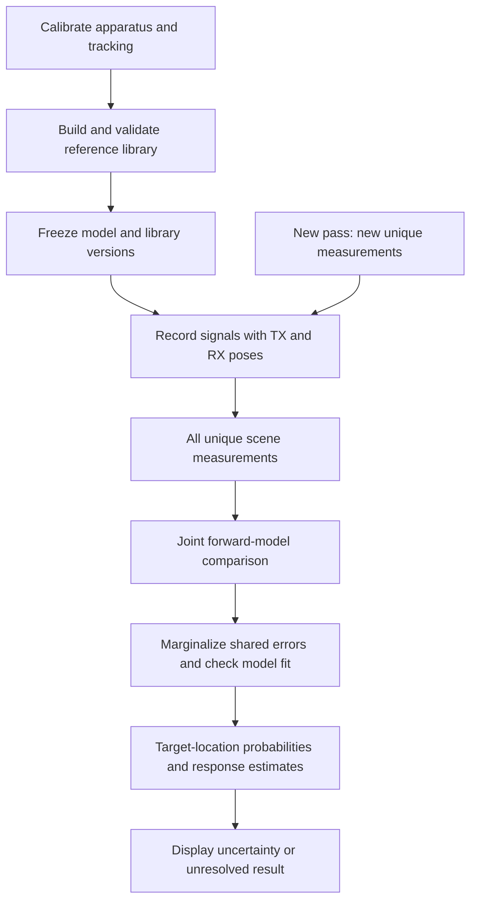

# Proposed reconstruction sequence

This is a concrete formulation of the concept, not an implemented or validated end-to-end algorithm. Standard statistical operations below are not claimed as inventions. The hardware candidate and its scope are specified in the [README](../README.md).

Published physical precedents are mapped in [Experimental basis](EXPERIMENTAL_BASIS.md); implementation interfaces are specified in [Design specification](DESIGN_SPEC.md). No trained parameters, executable reconstructor or raw experimental dataset are supplied by these documents.

## Measurement and reference preparation

For each sample, store a unique ID, station/pass and channel IDs, time and acquisition window, excitation waveform or frequency, measured TX current (including phase where needed), actual TX and RX centers and normals, carrier angle, calibrated transfer functions, background reference, and tracking/calibration uncertainty. Retain provenance and version identifiers.

Choose and document one acquisition convention. An illustrative frequency-domain observable is calibrated complex transfer impedance `y = V_RX / I_TX`, in V/A. A time-domain gated signal uses a different forward operator. Record available power/drive settings, but do not equate them with the field at the target.

1. **Calibration:** estimate channel gains/phases, direct coupling, pose lever arms, timing, noise and shared systematic errors independently of unknown test scenes.
2. **Reference learning:** measure known objects over declared depths, orientations, excitation settings and backgrounds. Estimate a response library and its variability; split by physical object and scene, not adjacent samples from the same scan.
3. **Inference:** freeze the library and use it with a physical forward model to estimate an unknown scene. Compare against physical inversion of the same data without that prior.

For compact linear targets, one example is `m = M_H H_TX`, with `M_H` in m³. It describes an object's response, not a universal material property independent of shape and size. Its rotation into world coordinates must be explicit. Full tensor estimation needs sufficient excitation diversity. Spectral response dictionaries and classification are established methods: [Wilson, Ledger & Lionheart](https://arxiv.org/abs/2110.06624).

## Map updates with a fixed learned model

The research target is improvement of the scene map as new registered measurements arrive. The pretrained parameters and reference library remain fixed throughout a survey. This does not prevent the inference from updating scene parameters or shared nuisance-variable estimates.

Conceptually, let D_k contain all uniquely identified measurements accepted through stage k, and let theta denote a fixed pretrained model or library version. The current map is Map(D_k; theta). Add genuinely new measurements to form the next dataset and recompute the map, or use an equivalent conditional update that handles shared errors correctly.

The previous map is a result derived from measurements, not an additional independent observation. Do not combine it as fresh evidence with the same full measurement history. Reduced apparent uncertainty is not itself proof of increased accuracy; new contradictory data may require a wider uncertainty region or an unresolved result.

The bounded model below specifies one physical/reference-based route to a map. It does not prescribe the architecture of a future learned reconstructor. That architecture, its training objective and the contribution of its learned component remain open implementation choices.

## A bounded hypothesis model

Let `H_j` specify an empty scene or a scene from a declared, finite target class: target count, positions, orientations and reference responses. This is a computational example; catalogue resolution and cost must be stated before use. Arbitrary shape and interacting multiple targets are not validated by the compact-target approximation.

Let `g_i` be the actual coil geometry, `u_i` the excitation, and `eta` shared nuisance variables such as a tracker offset or calibration bias. A forward model `F(H_j, g_i, u_i, eta)` predicts the recorded observable in its recorded units. Uncertainty bounds on nuisance variables come from independent calibration.

For one illustrative likelihood, stack real and imaginary residuals into a real vector `e = y - F` of length `n`:

`L(D | H_j, eta) = exp(-0.5 e^T R^-1 e) / sqrt((2 pi)^n det R)`.

Here `R` is a separately estimated positive-definite residual covariance. Do not double-count uncertainty represented explicitly by `eta` in `R`. If covariance depends on the hypothesis, its normalization cannot be dropped. Gaussian errors and prior independence below are assumptions requiring validation.

`p(H_j, eta | D) = L(D | H_j, eta) p(H_j) p(eta) / Z`.

Marginalize the shared variables and normalize over the declared scene hypotheses. Evaluate absolute model fit as well as relative weights: normalizing poor candidates does not make one correct. An out-of-model rule and thresholds need independent validation.

## What the spatial output means

`P_v = sum_j p(H_j | D) indicator(at least one target center of the declared class is in voxel v)`.

This is a probability of target-center location conditional on the catalogue, priors and error model. It is not metal occupancy. With multiple targets, the sum over voxels need not be one. Physical shape would require explicit shape hypotheses, suitable data and separate validation. A probability isosurface depicts an uncertainty region unless such validation establishes otherwise. AR adds its own registration error.

## Repeated passes

Add only new, uniquely identified measurements. Recompute the joint likelihood with shared nuisance variables and correlations, or use a mathematically equivalent conditional update without applying the prior twice. Re-reading the same file adds no evidence. The learned model and reference library remain fixed; only the inferred scene and associated uncertainty are updated.

A common translation of coil positions can be exchanged for a translation of the target in a translation-invariant free-space model. Repeated scans do not resolve that absolute-coordinate ambiguity without an external reference or other independent constraint.

The initial experiment uses a predefined scan. Adaptive measurement selection remains optional and has [earlier EMI precedents](../PRIOR_ART.md). No real-time computational performance is established.
